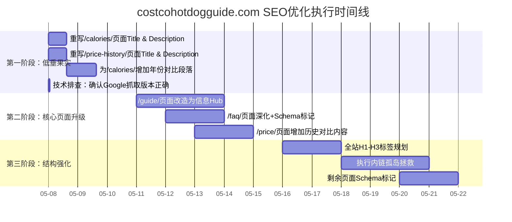

以下是根据我们所有讨论整理出的需求文档，可直接交付执行。

---

# costcohotdogguide.com SEO优化需求文档

**版本**: v1.0
**日期**: 2026-05-08
**项目背景**: 网站展示量持续增长（7天1006次），但点击率极低（0.50%），大量高排名关键词零点击，存在“有流量接不住”的严重问题。
**核心目标**: 在不新增页面的前提下，将全站平均CTR从0.50%提升至2%以上。

---

## 一、现状数据摘要

| 指标             | 当前值  | 说明                                                         |
| :--------------- | :------ | :----------------------------------------------------------- |
| 7天总展示量      | 1,006次 | 呈上升趋势（4/30: 31次 → 5/5: 243次）                        |
| 7天总点击量      | 5次     | 极低                                                         |
| 全站平均CTR      | 0.50%   | **核心问题**                                                 |
| 有点击的页面     | 仅3个   | `/ingredients/`, `/calories/`, `/price-history/`             |
| 高展示零点击页面 | 4个     | `/guide/`(167), `/faq/`(101), `/price/`(105), `/nutrition/`(80) |

---

## 二、问题诊断

### 2.1 核心问题：点击率崩盘
Google已给予网站足量展示（平均排名13.5），但搜索结果中的标题和描述未能说服用户点击。

### 2.2 关键症状

| 页面                 | 展示量 | 点击率 | 平均排名 | 症结                                |
| :------------------- | :----- | :----- | :------- | :---------------------------------- |
| `/guide/`            | 167    | **0%** | 7.30     | 排名第1页却零点击，最严重的流量漏洞 |
| `/hot-dog/faq/`      | 101    | **0%** | 13.16    | 未给出“即时答案”，用户转投他处      |
| `/hot-dog/price/`    | 105    | **0%** | 19.02    | 内容可能停留在事实陈述，缺乏深度    |
| `/hot-dog/calories/` | 377    | 0.27%  | 14.37    | 排名2.82的“2026”关键词零点击        |

### 2.3 低垂的果实（排名高但零点击的查询词）

| 查询词                                         | 展示 | 平均排名 | 对应页面              |
| :--------------------------------------------- | :--- | :------- | :-------------------- |
| `costco hot dog calories 2026`                 | 11   | 2.82     | `/hot-dog/calories/`  |
| `costco hot dog calories 2025 or 2026`         | 6    | 1.17     | `/hot-dog/calories/`  |
| `costco hot dog calories 2024 or 2025 or 2026` | 6    | 3.83     | `/hot-dog/calories/`  |
| `costco hot dog nutrition facts 2025 or 2026`  | 2    | 2.00     | `/hot-dog/nutrition/` |

---

## 三、优化方案（分阶段执行）

### 阶段一：急救低垂果实（第1-3天）

#### 需求1.1：重写`/hot-dog/calories/`页面标题和描述

**目标**: 立即收割排名前3但零点击的“年份类”关键词流量。

- **Title标签优化**:
  - 原Title（推测）: `Costco Hot Dog Calories`
  - 新Title: `2026 Costco Hot Dog Calories: 570 with Bun? (Updated Data & Yearly Comparison)`

- **Meta Description优化**:
  - 新Description: `2026最新Costco热狗卡路里数据。含面包570卡 vs 单肠？卡，附2024-2026逐年营养对比表。点击查看完整热量拆解。`

- **正文内容补充**: 在页面首屏后新增一个段落和对比表格：
  
  > "Costco热狗2024-2026营养变化对比：我们对近三年营养标签进行了逐年追踪，发现……（插入年份对比表格，含热量、脂肪、钠含量）"

#### 需求1.2：重写`/tools/price-history/`页面标题和描述

**目标**: 转化搜索“价格历史”的高意图用户。

- **Title标签优化**:
  - 新Title: `Costco Hot Dog Price History: $1.50 Since 1985? (Interactive Chart)`

- **Meta Description优化**:
  - 新Description: `查看Costco热狗价格历史完整时间线（1985-2026）。交互式图表展示$1.50传奇的坚守与通胀压力。含与其他Costco食品价格对比。`

---

### 阶段二：修复核心薄页面（第4-10天）

#### 需求2.1：`/guide/` 页面改造为信息Hub（最高优先级）

**目标**: 解决167次展示零点击问题。放弃单纯的长文形式，改为“核心信息卡片+详情入口”的Hub结构。

**页面结构要求**:

1. **首屏 - 核心信息卡**（三栏并排）:
   - 卡片1：价格 - $1.50  → 链接至 `/hot-dog/price/`
   - 卡片2：热量 - 570 cal（含面包） → 链接至 `/hot-dog/calories/`
   - 卡片3：成分概览 - 全牛肉热狗肠，无人工添加 → 链接至 `/ingredients/`

2. **中部 - 价格历史预览**:
   - 嵌入 `/tools/price-history/` 的价格趋势静态缩略图
   - 下方按钮：`查看交互式历史图表 →`

3. **下部 - 热门FAQ直答区**:
   - 列出5个最常见问题，**直接给出简短答案**（非折叠，非链接到其他页）
   - 每题答案末尾加 `[了解更多]` 链接至 `/hot-dog/faq/`

4. **SEO元标签**:
   - Title: `Costco Hot Dog Ultimate Guide: Price, Calories, Ingredients (2026)`
   - Description: `查找Costco热狗所有核心信息：$1.50价格详解、570卡热量拆解、全成分列表与过敏原提示、历史价格图表。一站式指南，立即查看。`

#### 需求2.2：`/hot-dog/faq/` 页面内容深化

**目标**: 解决101次展示零点击问题，让页面能直接回答用户问题。

**修改要求**:

1. **每个FAQ问题必须满足**:
   - 答案在首行直接给出（不超过25个字）
   - 第二段展开详细解释
   - 使用FAQPage Schema标记

2. **问题覆盖范围**（基于GSC查询数据）:
   - 必含：热狗是否犹太洁食、含多少钠、面包是否含乳制品、如何烹饪、原料来源
   - Schema示例代码:

```json
{
  "@context": "https://schema.org",
  "@type": "FAQPage",
  "mainEntity": [{
    "@type": "Question",
    "name": "Is Costco hot dog kosher?",
    "acceptedAnswer": {
      "@type": "Answer",
      "text": "No. Costco hot dogs are all-beef but not certified kosher. The bun may contain dairy, making it not kosher overall."
    }
  }]
}
```

3. **SEO元标签**:
   - Title: `Costco Hot Dog FAQ: Kosher? Sodium? Bun Dairy? (Direct Answers)`
   - Description: `直接回答Costco热狗最常见问题：是否犹太洁食、钠含量、面包含乳制品吗、烹饪方法。FAQ格式，附带结构化数据，快速获取答案。`

#### 需求2.3：`/hot-dog/price/` 页面深度升级

**目标**: 解决105次展示零点击问题，匹配用户对“价格分析”的深层需求。

**修改要求**:

1. **新增内容区块**:
   - 价格历史时间线（文字+数据，引用`/tools/price-history/`的结论）
   - 与其他Costco食品价格对比（烤鸡$4.99、Pizza切片$1.99）
   - 与通胀率对比分析段落（“如果跟通胀，今天应该卖$4.XX”）

2. **SEO元标签**:
   - Title: `Costco Hot Dog Price: Still $1.50? History & Inflation Analysis`
   - Description: `深入分析Costco热狗价格：为何40年不涨价？对比通胀率真实价值、与其他Costco食品价格对比。含链接至完整价格历史交互图表。`

---

### 阶段三：结构与内链强化（第11-17天）

#### 需求3.1：全站TDH标签体系规范化

为每个核心页面明确指定H1-H3层级结构。

| 页面                 | H1                                              | H2（示例）                                           | H3（示例）                      |
| :------------------- | :---------------------------------------------- | :--------------------------------------------------- | :------------------------------ |
| `/guide/`            | The Ultimate Costco Hot Dog Guide (2026)        | Price, Calories, Ingredients, FAQ                    | （按需细分）                    |
| `/hot-dog/calories/` | Costco Hot Dog Calories & Full Nutrition (2026) | Total Calories, Bun vs No Bun, Yearly Comparison     | 2026 Data, 2025 Data, 2024 Data |
| `/hot-dog/faq/`      | Costco Hot Dog Frequently Asked Questions       | About Ingredients, About Nutrition, About Price      | —                               |
| `/hot-dog/price/`    | Costco Hot Dog Price: History & Analysis        | Current Price, Historical Timeline, Inflation Impact | —                               |

#### 需求3.2：执行“孤岛拯救”内链计划

**目标**: 确保从首页3次点击内可到达任何重要页面。

**具体要求**:

1. **`/guide/` 页面**: 信息卡片区的按钮、FAQ区的“了解更多”链接、中部预览图的“查看完整图表”链接，均需指向对应详情页。

2. **`/hot-dog/calories/` 页面**: 在正文中自然添加内链：
   - "想知道脂肪含量详情？查看我们的 [Costco Hot Dog Fat & Sodium breakdown](/hot-dog/nutrition/)。"
   - "关于热狗面包是否含乳制品，请参考 [FAQ: Bun Ingredients](/hot-dog/faq/#bun)。"

3. **`/hot-dog/faq/` 页面**: 每个详细答案末尾添加“深入了解：[相关详情页标题](URL)”链接。

4. **全站排查**: 确保所有页面至少被一个其他页面在正文中链接到，无孤立页面。

#### 需求3.3：结构化数据补充

**需标记的页面**:

| 页面                    | Schema类型           | 备注                             |
| :---------------------- | :------------------- | :------------------------------- |
| `/hot-dog/faq/`         | FAQPage              | 每个问答对用JSON-LD标记          |
| `/hot-dog/calories/`    | NutritionInformation | 标记热量、脂肪、蛋白质等核心数值 |
| `/tools/price-history/` | Dataset              | 如有价格时间序列数据，可标记     |

---

## 四、执行时间线



---

## 五、效果检查点

| 检查时间 | 指标                                  | 目标值             |
| :------- | :------------------------------------ | :----------------- |
| 第2周末  | `costco hot dog calories 2026` 点击率 | 从0%提升至 ≥ 2%    |
| 第2周末  | `/guide/` 页面点击率                  | 从0%提升至 ≥ 1.5%  |
| 第4周末  | `/faq/` 页面点击率                    | 从0%提升至 ≥ 2%    |
| 第4周末  | 全站平均CTR                           | 从0.50%提升至 ≥ 2% |
| 第6周末  | 全站平均排名                          | 从13.5提升至 ≤ 10  |

---

## 六、补充注意事项

1. **每次修改Title/Description后**，立即使用Google Search Console的“网址检查”工具提交对应的URL重新抓取，确保Google快速获取最新版本。
2. **所有修改在移动端测试**：数据表明移动端是唯一产生点击的设备（CTR 1.12%），桌面端目前为零。修改后需在手机尺寸下验证标题截断是否合理、卡片布局是否正常。
3. **不新增任何页面**：所有操作仅限于修改现有页面内容、元标签、结构化数据和内链。
4. `/guide/`页面改造为Hub后，注意检查页面加载速度，避免因增加图片和卡片导致性能下降。

---

*文档结束*