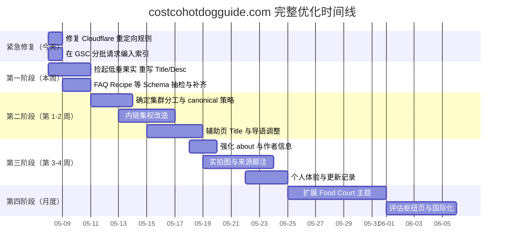

# costcohotdogguide.com 完整 SEO 优化及解决方案

**版本**: v4.0（最终整合版）  
**日期**: 2026-05-08  
**针对域名**: https://costcohotdogguide.com  

**当前状态**: 已收录，但 CTR 极低（约 0.50%），存在关键词内耗风险，内容深度不足，EEAT 有待加强。

---

## 核心诊断

你的网站有一个非常好的框架和定位，但目前卡在「有曝光，无点击」和「内容内耗」这两个关键瓶颈上。问题的根源不是没被收录，而是：

1. **用户不点击**：Title / Description 缺乏吸引力。
2. **权重被分散**：多个页面竞争相近意图，难以形成清晰的「首选落地页」。
3. **内容不够深**：在营养类食品主题下，用户对可信度与来源有更高期望。

所有优化必须围绕「减少无效竞争、提升点击率、注入可验证的真实价值」来展开。

---

## 第一阶段：紧急修复技术问题（今天执行）

**目标**：消除任何妨碍搜索引擎抓取与索引的障碍。

### 1.1 修复 Cloudflare 重定向规则

**问题**：若规则 `https://www.*` 未正确匹配子路径，可能导致 www 子页无法统一 301。

**操作**：

- 匹配字段：**主机名**；运算符：**等于**；值：`www.costcohotdogguide.com`。
- 目标 URL 表达式示例：`concat("https://costcohotdogguide.com", http.request.uri.path)`

**检查点**：使用 Redirect Path 等工具测试  
`https://www.costcohotdogguide.com/about/` 是否 **301** 到  
`https://costcohotdogguide.com/about/` 并最终 **200**。

### 1.2 批量请求编入索引

**操作**：在 Google Search Console 中，用「网址检查」对曾出现「已发现 - 尚未编入索引」或近期大改的**核心 URL** 提交「请求编入索引」（控制批次与频率，优先流量与转化页）。

---

## 第二阶段：重构页面结构，消除关键词内耗（第 1–2 周）

**目标**：建立主题集群，明确每个 URL 的主意图，减少自相竞争。

### 2.1 「官方排名页」规划（原则）

**原则**：同一核心商业意图尽量对应 **一个** 主力承接页；其余页面承担细分长尾或枢纽，而非复制同一篇答。

| 意图类别 | 主力承接页建议 | 辅助 / 集群页 | 核心操作 |
|---------|----------------|-----------------|----------|
| 卡路里 | `/hot-dog/calories/` | `/hot-dog/nutrition/`、`/guide/` | 集群互链；避免各页 Title 抢同一主词 |
| 成分 | `/ingredients/`（或成分集群首页） | `/hot-dog/ingredients/`、`/hot-dog/faq/` | 成分类查询锚文本指向成分枢纽 |
| 价格历史（工具） | `/tools/price-history/` | `/hot-dog/price-history/`（叙事） | **工具 vs 叙事分工**，勿混为一谈 |
| FAQ | `/hot-dog/faq/` 或站点 `/faq/` 枢纽 | 各专题短文 | 深度 FAQ 集中在枢纽，短文指向枢纽 |
| 营养总览 | `/hot-dog/nutrition/` | 各子指标页 | 宏观导航 + 指向官方子页 |

### 2.2 技术消除内耗（建议分步）

1. **Canonical**：仅对**重复或极度近似**的 URL 使用 canonical；不同意图的正文页不应强行 canonical 到另一 URL（否则可能误导 Google 与用户）。优先修复真正的重复模板（参数页、打印页等）。
2. **内链集权**：全站正文链接优先指向「该意图下最深、最匹配的一篇」，锚文本具体（如「含面包与不含面包的热量对比」）。
3. **标题去重**：辅助页 Title 避免与主力页重复同一主关键词堆砌。
4. **内容分工**：主力页承担深度与数据；辅助页承担摘要 + 「深入了解 → 主力页」。

---

## 第三阶段：捡起低垂果实，提升点击率（第 1–3 天，持续迭代）

**目标**：在不增加新页面的前提下，快速提升 CTR。

### 3.1 重写「零点击」页面的 Title 和 Description

从 GSC 筛选展示量高、CTR 偏低的 URL，按批次重写元标签。

**示例方向（需按实际上线与截断测试微调）**：

| 页面 | 数据印象（GSC 参考） | Title 优化方向示例 |
|------|----------------------|-------------------|
| `/guide/` | 高展示、低点击 | The Ultimate Costco Hot Dog Guide (2026): Nutrition, Price, History |
| `/hot-dog/faq/` | 高展示、低点击 | Costco Hot Dog FAQ: Kosher, Sodium, Ingredients (Direct Answers) |
| `/hot-dog/price/` | 高展示、低点击 | Costco Hot Dog Price: Still $1.50? History & Context |
| `/hot-dog/calories/` | 展示高、CTR 偏低 | 2026 Costco Hot Dog Calories: With/Without Bun (Comparison) |

**优化思路**：`[核心意图]` + `[差异化信息]` + `[时效或场景]`（移动端注意长度）。

### 3.2 结构化数据

- FAQ 枢纽页：FAQPage（与可见问答一致）。
- 食谱类页：Recipe（若步骤与配料完整）。
- 工具页：按需 Dataset / WebApplication（与页面事实一致）。

上线后用 Rich Results Test 抽检。

---

## 第四阶段：注入 EEAT（第 3–4 周）

**目标**：提升可信度与「真实站点」信号（尤其在营养相关主题下）。

1. **作者 / 关于**：强化 `/about/`（若已有则扩充），说明立场、更新频率、联系方式。
2. **实拍与原创媒体**：替换或补充非独有配图；食品场景优先实拍。
3. **来源与体验**：营养数字旁标注来源（如 USDA、标签）；适度加入可验证的第一手观察（避免编造）。
4. **更新痕迹**：重要页保留「最后更新」与实质修订记录。

---

## 第五阶段：Food Court 扩展（月度 & 长期）

**目标**：在热狗集群稳定后，再扩展到 Pizza、Chicken Bake 等，并考虑枢纽页（是否新建 URL 需单独评审）。

**国际化**：若 GSC 持续出现国家词（如 Australia），可用 hreflang 或地区段落先行验证需求，再决定是否单独目录。

---

## 执行时间线

---

## 总结

域名与定位清晰，当前瓶颈在**执行精度**：CTR、集群分工、可信度与持续迭代。

**立即行动清单（今天）**：

1. 修复 Cloudflare www → apex 重定向（全路径有效）。
2. 在 GSC 对优先 URL 分批请求编入索引。
3. 筛选并重写一批「高展示、低 CTR」页面的 Title 与 Description。

---

## 附录：与仓库内 OpenSpec / v2 执行准则的对齐说明

以下内容用于避免与已在 `openspec/changes/seo-ctr-recovery-2026-05-08/` 中固化的原则冲突：

- **不粗暴合并营养长尾页**：保留 `calories`、`sodium`、`carbs` 等承接长尾；用分工与内链协作，而非单一超长页替代全部。
- **301 / canonical 需谨慎**：仅在有明确重复或 GSC 证明长期 cannibalization 且优化无效时，再对具体 URL 做 301；**勿**将叙事页 `/hot-dog/price-history/` 与工具页 `/tools/price-history/` 默认合并——二者意图不同。
- **程序化页面**：`/tools/price-history/` 类页面继续强化工具价值，不因「程序化」标签被削弱。
- **批次发布**：Title、集群、Schema 分批上线，每批保留 5–7 天观察窗口，便于归因。

仓库内对应执行清单见：`openspec/changes/seo-ctr-recovery-2026-05-08/tasks.md`。
